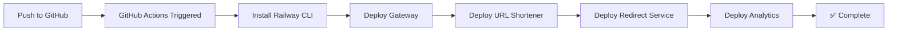

# 🚂 Railway Deployment Guide

Hướng dẫn deploy URLShortener Microservices lên Railway với GitHub Actions.

## 📋 Prerequisites

1. Tài khoản [Railway](https://railway.app)
2. Repository GitHub đã push code
3. Railway CLI (optional cho local testing)

## 🔧 Setup Railway Project

### Bước 1: Tạo Project trên Railway

1. Đăng nhập vào [railway.app](https://railway.app)
2. Click **"New Project"**
3. Chọn **"Empty Project"**
4. Đặt tên project: `urlshortener-microservices`

### Bước 2: Thêm Services

#### 2.1. Thêm MySQL Database
1. Click **"+ New"** → **"Database"** → **"Add MySQL"**
2. Tên service: `mysql`
3. Railway tự động tạo credentials

#### 2.2. Thêm RabbitMQ
1. Click **"+ New"** → **"Empty Service"**
2. Tên service: `rabbitmq`
3. Vào **Settings** → **Source** → **"Deploy from Docker Image"**
4. Image: `rabbitmq:3-management`
5. Trong **Variables**, thêm:
   ```
   RABBITMQ_DEFAULT_USER=guest
   RABBITMQ_DEFAULT_PASS=guest
   ```

#### 2.3. Thêm Gateway Service
1. Click **"+ New"** → **"GitHub Repo"**
2. Chọn repository `URLShortener`
3. Tên service: `gateway`
4. Railway sẽ tự động detect Dockerfile từ `src/Gateway/railway.json`
5. Trong **Settings** → **Build**:
   - **Builder**: Railpack (default) - Railway sẽ tự detect Dockerfile
   - **Watch Paths**: `src/Gateway/**` (optional - để chỉ rebuild khi Gateway thay đổi)
6. Trong **Variables**, thêm:
   ```
   ASPNETCORE_ENVIRONMENT=Production
   ASPNETCORE_URLS=http://+:$PORT
   ```
7. Trong **Settings** → **Deploy**:
   - **Pre-deploy Command**: để trống
   - **Restart Policy**: On Failure (10 retries)

#### 2.4. Thêm URL Shortener Service
1. Click **"+ New"** → **"GitHub Repo"**
2. Chọn repository `URLShortener`
3. Tên service: `urlshortener-service`
4. Railway sẽ tự động detect Dockerfile từ `src/Services/UrlShortenerService/railway.json`
5. Trong **Settings** → **Source**:
   - **Root Directory**: `/` (để mặc định)
6. Trong **Settings** → **Build**:
   - **Watch Paths**: `src/Services/UrlShortenerService/**` (optional)
7. Trong **Variables**, thêm:
   ```
   ASPNETCORE_ENVIRONMENT=Production
   ASPNETCORE_URLS=http://+:$PORT
   ConnectionStrings__DefaultConnection=${{MySQL.DATABASE_URL}}
   BaseUrl=https://${{gateway.RAILWAY_PUBLIC_DOMAIN}}
   ```

#### 2.5. Thêm Redirect Service
1. Click **"+ New"** → **"GitHub Repo"**
2. Chọn repository `URLShortener`
3. Tên service: `redirect-service`
4. Railway sẽ tự động detect Dockerfile từ `src/Services/RedirectService/railway.json`
5. Trong **Settings** → **Source**:
   - **Root Directory**: `/` (để mặc định)
6. Trong **Settings** → **Build**:
   - **Watch Paths**: `src/Services/RedirectService/**` (optional)
7. Trong **Variables**, thêm:
   ```
   ASPNETCORE_ENVIRONMENT=Production
   ASPNETCORE_URLS=http://+:$PORT
   ConnectionStrings__DefaultConnection=${{MySQL.DATABASE_URL}}
   RabbitMQ__HostName=${{rabbitmq.RAILWAY_PRIVATE_DOMAIN}}
   RabbitMQ__Port=5672
   RabbitMQ__UserName=guest
   RabbitMQ__Password=guest
   ```

#### 2.6. Thêm Analytics Service
1. Click **"+ New"** → **"GitHub Repo"**
2. Chọn repository `URLShortener`
3. Tên service: `analytics-service`
4. Railway sẽ tự động detect Dockerfile từ `src/Services/AnalyticsService/railway.json`
5. Trong **Settings** → **Source**:
   - **Root Directory**: `/` (để mặc định)
6. Trong **Settings** → **Build**:
   - **Watch Paths**: `src/Services/AnalyticsService/**` (optional)
7. Trong **Variables**, thêm:
   ```
   DOTNET_ENVIRONMENT=Production
   ConnectionStrings__DefaultConnection=${{MySQL.DATABASE_URL}}
   RabbitMQ__HostName=${{rabbitmq.RAILWAY_PRIVATE_DOMAIN}}
   RabbitMQ__Port=5672
   RabbitMQ__UserName=guest
   RabbitMQ__Password=guest
   ```

### Bước 3: Expose Gateway ra Internet

1. Vào service **gateway**
2. Tab **Settings** → **Networking**
3. Click **"Generate Domain"** hoặc thêm custom domain
4. Copy domain này (ví dụ: `gateway-production-xxxx.up.railway.app`)

### Bước 4: Cấu hình Ocelot Gateway

Cập nhật file `src/Gateway/ocelot.json` với các internal URLs của Railway:

```json
{
  "Routes": [
    {
      "DownstreamPathTemplate": "/api/urls/{everything}",
      "DownstreamScheme": "http",
      "DownstreamHostAndPorts": [
        {
          "Host": "urlshortener-service.railway.internal",
          "Port": 8080
        }
      ],
      "UpstreamPathTemplate": "/api/urls/{everything}",
      "UpstreamHttpMethod": [ "GET", "POST", "PUT", "DELETE" ]
    },
    {
      "DownstreamPathTemplate": "/{shortCode}",
      "DownstreamScheme": "http",
      "DownstreamHostAndPorts": [
        {
          "Host": "redirect-service.railway.internal",
          "Port": 8080
        }
      ],
      "UpstreamPathTemplate": "/{shortCode}",
      "UpstreamHttpMethod": [ "GET" ]
    }
  ],
  "GlobalConfiguration": {
    "BaseUrl": "https://your-gateway-domain.up.railway.app"
  }
}
```

## 🔐 Setup GitHub Actions

### Bước 1: Lấy Railway Token

1. Vào [Railway Dashboard](https://railway.app/account/tokens)
2. Click **"Create Token"**
3. Đặt tên: `GitHub Actions Deploy`
4. Copy token (chỉ hiển thị 1 lần!)

### Bước 2: Thêm Secret vào GitHub

1. Vào GitHub repository → **Settings** → **Secrets and variables** → **Actions**
2. Click **"New repository secret"**
3. Tên: `RAILWAY_TOKEN`
4. Value: Paste token từ Railway
5. Click **"Add secret"**

### Bước 3: Test GitHub Actions

1. Push code lên GitHub:
   ```bash
   git add .
   git commit -m "Add Railway deployment configuration"
   git push origin master
   ```

2. Vào tab **Actions** trên GitHub để xem deployment progress

## 🔄 Deployment Flow



## 📊 Monitoring & Logs

### Xem Logs
1. Vào Railway Dashboard
2. Chọn service cần xem
3. Tab **"Deployments"** → Click vào deployment mới nhất
4. Xem logs real-time

### Health Check
Test các endpoints:
```bash
# Gateway health
curl https://your-gateway-domain.up.railway.app/health

# Create short URL
curl -X POST https://your-gateway-domain.up.railway.app/api/urls \
  -H "Content-Type: application/json" \
  -d '{"longUrl": "https://example.com"}'

# Redirect test
curl -L https://your-gateway-domain.up.railway.app/{shortCode}
```

## 🔧 Troubleshooting

### Problem: Build fails

**Solution**: Kiểm tra Dockerfile paths trong Railway settings

### Problem: Service không kết nối được với MySQL

**Solution**: 
- Verify connection string variable: `${{MySQL.DATABASE_URL}}`
- Check MySQL service đang running
- Xem logs để debug connection errors

### Problem: RabbitMQ connection failed

**Solution**:
- Verify RabbitMQ service đang running
- Check private domain: `${{rabbitmq.RAILWAY_PRIVATE_DOMAIN}}`
- Verify credentials (guest/guest)

### Problem: Services không giao tiếp được với nhau

**Solution**:
- Sử dụng Railway's private networking
- Format: `{service-name}.railway.internal`
- Port: 8080 (như định nghĩa trong Dockerfile)

## 💰 Cost Estimation

Railway Free Tier:
- $5 credit/month
- Thường đủ cho development/testing
- Upgrade to Hobby ($5/month) hoặc Pro nếu cần nhiều resources

## 🚀 Production Considerations

1. **Environment Variables**: Đừng hardcode secrets
2. **Database Backups**: Enable automated backups trên Railway
3. **Monitoring**: Setup alerts cho service downtime
4. **Scaling**: Railway tự động scale, nhưng cần monitor usage
5. **Custom Domains**: Setup domain của bạn thay vì Railway domain
6. **SSL/TLS**: Railway tự động provision SSL certificates

## 📚 Additional Resources

- [Railway Docs](https://docs.railway.app/)
- [Railway CLI](https://docs.railway.app/develop/cli)
- [GitHub Actions for Railway](https://github.com/marketplace/actions/railway-deploy)

## 🎯 Next Steps

1. ✅ Setup Railway project
2. ✅ Configure services
3. ✅ Add GitHub secrets
4. ✅ Push code to trigger deployment
5. 🔄 Monitor deployment
6. ✅ Test endpoints
7. 📊 Setup monitoring alerts
8. 🌐 Configure custom domain (optional)

---

**Happy Deploying! 🚂✨**
